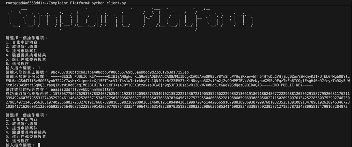

# Complaint Platform Based On Crowd Wisdom

基於群眾智慧與加密技術，有效提升申訴案件品質。

## 壹、基本說明
**一、目標：**
在企業治理中，匿名申訴制度是揭露內部不當行為的重要機制。然而，現行制度面臨兩大挑戰：其一，惡意或虛假的申訴難以追溯，易造成資源浪費與名譽損害；其二，員工因擔憂身份外洩，往往選擇噤聲，影響制度實效。如何在保障匿名性的前提下，防範濫用與虛假申訴，成為當前亟待解決的關鍵課題。

**二、設計概念：**
本計畫旨在以此為核心，提出雙重設計目標：首先，透過盲簽章機制，確保申訴者為合法員工，並無需揭露其真實身份。同時，當申訴平台遭遇惡意濫用時，亦能通過集體決策機制公開申訴者身份；其次，引入群眾仲裁機制，對申訴事項進行初步篩選與核實，從而有效降低惡意濫用的風險，並提升整體申訴制度的可信度與可行性。為實現上述目標，本專案設計了多層次的協定機制，具體流程如下：
* 憑證發放：每月初，平台將生成包含多張「申訴憑證」的憑證池，這些憑證具一次性使用性並設有有效期限。生成後，憑證池將儲存於.txt文件中，並確保每位員工收到的內容相同。接著，平台將利用員工的身份證字號對該文件進行AES加密處理，確保加密後的憑證池僅能由該員工進行解密使用。最終，所有加密後的憑證池將通過電子郵件發送給員工，有效防止企業通過申請頻率追蹤員工身份。
* 盲化憑證：通過這一步驟，員工將申訴內容進行盲化處理後，能夠透過申訴憑證獲取平台所賦予的盲化憑證，從而確認該申訴內容已獲得平台認證。當客戶端程式進行盲化憑證作業時，系統會要求申訴員工輸入員工編號以完成操作。該驗證程序僅在本機端執行，不會將任何申訴員工的身分資訊對外傳輸或外洩。
* 匿名申訴提交：最終，員工將使用盲簽憑證與申訴內容一同提交，平台能夠驗證申訴的合法性，但無法識別員工的具體身份。
* 仲裁委員隨機抽選：為確保抽選過程的公開與公正，平台將採用可驗證的隨機函數對全體員工進行隨機抽選，選出仲裁員，並通過電子郵件通知當選者，隨信附上「仲裁任務票據」。該票據將包含案件標號、申訴內容、投票須知、申訴使用的門檻簽章私鑰分片及能夠驗證抽籤過程的重要參數。
* 仲裁案件投票：仲裁員需憑「仲裁任務票據」憑證登入平台，對申訴內容進行投票，確認是否同意立案，並使用案件標號及門檻簽章私鑰分片完成簽署。門檻簽章的私鑰分片在創建後，會分別分發給各仲裁委員，伺服器端不會儲存完整私鑰或任何私鑰分片。於開票階段進行門檻簽章驗證時，系統將透過仲裁委員會成立時所加密的文件進行驗證，以確認是否能成功解密並據此判定投票結果的有效性。
* 開票：平台將彙整所有仲裁員提交的投票結果，以此作為仲裁委員會的集體決策。為避免外界推知實際參與仲裁的成員，本專案設計了「擴大抽選集合」機制。例如，平台可隨機抽選20名仲裁員，但僅要求其中至少過半數（如 10人）於期限內回覆即可。仲裁員透過私鑰分片進行簽署，以表達同意或反對。當同意票數達到三分之二門檻時，該申訴即視為正式通過。通過的申訴將進入立案程序，並交由專責委員會進行後續處理。若未達到最低參與人數門檻，則平台將重新進行仲裁員抽選，以確保程序的完整性與決策的正當性。
本計劃機制在保障匿名性的同時，透過隨機抽選與門檻簽章，確保仲裁決策具集體性，進而提升員工對匿名申訴制度的信任。

**三、開發環境：**
以下是開發客戶端與伺服器所採用的環境：
* 虛擬機：Docker
* 程式語言：Python
* RESTful API：Flask
* 資料庫：MongoDB
* 程式編輯器：Visual Studio Code

## 貳、操作說明
**一、安裝步驟：**
1. 建立容器：可使用Docker建立多個Linux容器，其中一個容器將作為伺服器，作為申訴平台；其餘容器則模擬多個客戶端，用以進行申訴者與仲裁委員的互動操作。
2. 安裝軟體：請於容器環境中預先安裝Python與MongoDB，以確保系統能順利運行。
3. 下載檔案：請於作為伺服器的容器中下載並部署Server檔案，其他作為客戶端節點的容器則下載Client檔案以進行模擬。
4. 使用相依套件：
* 伺服器
```bash
pip install Flask
pip install apscheduler
pip install cryptography
pip install pyzipper
pip install pymongo
pip install sympy
```
* 客戶端
```bash
pip install cryptography
pip install requests
```
5. 啟動系統
* 在伺服器容器中開啟伺服器程式
```shell
python server.py
```
* 客戶端節點的容器開啟程式
```shell
python client.py
```
> [!Warning]
> 請特別注意，在server.py與client.py程式中，請前往固定常數變數宣告的位置，修改為實際建立之容器的主機名稱（host）與連接埠（port），以確保程式能正確運行。

**二、運行方式：**
1. 分享檔案：請在P2P_Client資料夾中建立一個名為shared的子資料夾。若有檔案欲分享，請將其複製至該資料夾中，即可供其他節點存取。
2. 主選單提供四項功能選擇，分別為：
* 註冊分享檔案：當有檔案複製至 shared 資料夾後，需透過此選項完成註冊程序；
* 查詢分享檔案：可查看目前網路中已註冊的可分享檔案清單；
* 下載分享檔案：從其他節點下載所需檔案；
* 退出程式：結束應用程式運行。
<br>
  <div align="center">
  	
  </div>
<br>
